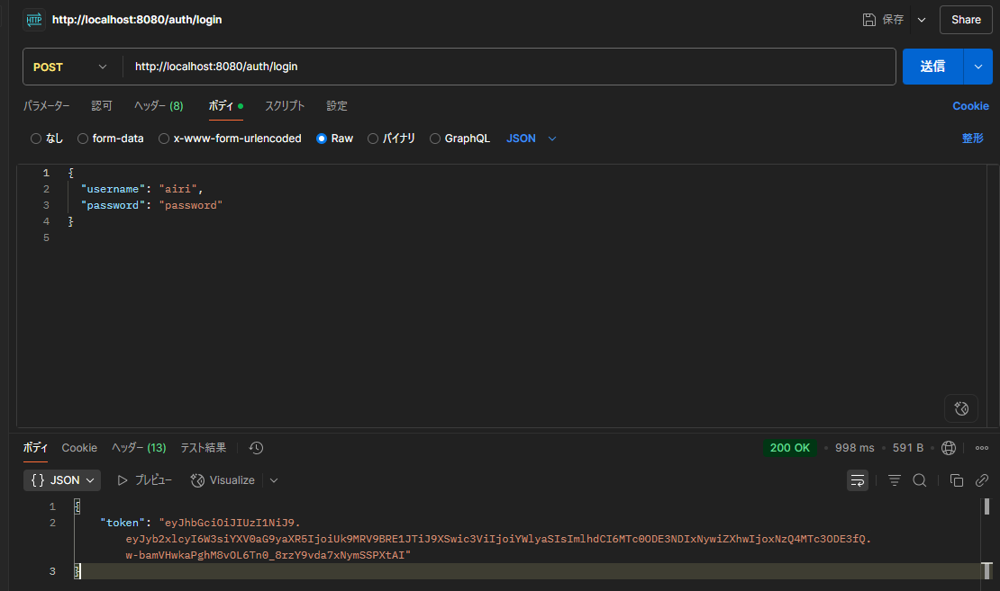
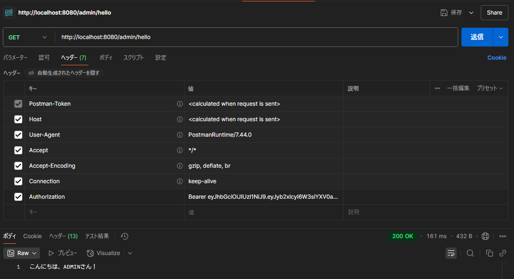

# Spring Boot Login JWT App
✅ テスト済み


## 🔧 使用技術
- Spring Boot 3.2
- Spring Security + JWT
- H2 Database（ファイルモード）
- REST API（Postman / Swagger 対応）

## 💡 機能概要
- DB連携ユーザーによるログイン認証
- JWTトークンによる認証・認可
- ロール（ADMIN / USER）制御
- `/auth/login` でトークン取得、`/admin/hello` で認可付きAPI呼び出し

## 🧪 テスト方法
1. `/auth/login` に下記JSONでPOST
```json
{
  "username": "airi",
  "password": "password"
}
```
2. 返されたトークンを /admin/hello にAuthorizationヘッダーで送信
```
Authorization: Bearer <token>
```

## ✅ テストについて

認証機能に対する以下のテストコードを導入済みです。

### 🔸 統合テスト（Integration Test）
- `AuthControllerIntegrationTest.java`
    - H2データベースを使用し、実際のAPI (`/auth/login`) に対するリクエスト/レスポンスを検証
    - 成功・失敗ケースのログイン検証を実施

### 🔸 ユニットテスト（Unit Test）
- `AuthControllerTest.java`
    - `AuthenticationManager` や `UserDetailsService` をMock化し、`AuthController` の挙動を個別に検証
    - 正常ログイン時のトークン発行・例外スローの検証を実施

📦 テストは `JUnit5` + `Mockito` + `Spring Boot Test` にて構築されています。

🧪 テスト結果は以下の通りです：

```bash
Tests run: 5, Failures: 0, Errors: 0, Skipped: 0
BUILD SUCCESS
```
### 📁 関連ファイル構成
```
src/test/java/com/example/hello_springboot/controller/
├── AuthControllerIntegrationTest.java
└── AuthControllerTest.java
```

## 🖼️ 実行イメージ

### 🔐 トークン取得（/auth/login）


### ✅ 認証付きAPIアクセス（/admin/hello）

## 🔒 ロール制御の詳細
| URL            | ロール          | 内容           |
| -------------- | ------------ | ------------ |
| `/admin/hello` | `ROLE_ADMIN` | 管理者専用メッセージ返却 |

## 🏗️ 今後追加予定
- Reactとの画面連携
- Swagger UI対応
- トークン有効期限＋リフレッシュ